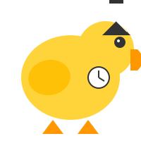

# Early Bird - Start Assignments Early, Earn Rewards!

Early Bird is a web application designed to incentivize students to start their assignments early rather than waiting until the last minute before the deadline. By completing work ahead of schedule, users earn "QuackCoins" which contribute to their ranking on a leaderboard.



## Team Members

-   Sara
-   Shasha
-   Whybhav

## Project Description

### What is Early Bird?

Early Bird is a productivity app that gamifies the process of completing academic assignments. The application features a duck-themed interface that:

-   Tracks assignment progress with an animated duck that moves along a progress bar
-   Awards "QuackCoins" when assignments are completed early
-   Shows a leaderboard of friends ranked by their QuackCoin totals
-   Provides insights on time management and early completion statistics

### The Problem We're Solving

Many students struggle with procrastination, often starting assignments just before they're due. This leads to stress, lower quality work, and poor time management habits. Early Bird addresses this by providing:

1. Visual motivation through animated progress tracking
2. Social accountability through friend leaderboards
3. Gamified rewards for early completion
4. Detailed analytics on productivity patterns

## Technologies Used

### Frontend

-   Next.js 15
-   React 19
-   TailwindCSS 4
-   Geist UI Font

### Backend

-   Flask API
-   SQLAlchemy
-   JWT Authentication
-   PostgreSQL Database

## Features

-   **User Authentication**: Secure magic link email authentication system
-   **Assignment Dashboard**: Visual tracking of all current assignments
-   **Progress Visualization**: Animated duck character that walks along progress bars
-   **QuackCoins System**: Reward algorithm that incentivizes early completion
-   **Leaderboard**: Social comparison with friends to encourage productivity
-   **Dark/Light Mode**: Accessibility-focused theme options
-   **Profile Management**: Customizable user preferences and stats

## Getting Started

### Prerequisites

-   Node.js 18+ (for frontend)
-   Python 3.10+ (for backend)
-   npm or yarn
-   pip

### Frontend Setup

1. Clone the repository

    ```
    git clone https://github.com/your-username/early-bird.git
    cd early-bird
    ```

2. Install dependencies

    ```
    npm install
    # or
    yarn install
    ```

3. Create `.env.local` file

    ```
    NEXT_PUBLIC_API_URL=http://localhost:5000/api
    ```

4. Run the development server

    ```
    npm run dev
    # or
    yarn dev
    ```

5. Open [http://localhost:3000](http://localhost:3000) in your browser

### Backend Setup

1. Navigate to the backend directory

    ```
    cd backend
    ```

2. Create a virtual environment

    ```
    python -m venv venv
    source venv/bin/activate  # On Windows: venv\Scripts\activate
    ```

3. Install dependencies

    ```
    pip install -r requirements.txt
    ```

4. Create `.env` file

    ```
    FLASK_ENV=development
    SECRET_KEY=your-secret-key
    SECURITY_PASSWORD_SALT=your-password-salt
    DATABASE_URL=sqlite:///early_bird.db
    FRONTEND_URL=http://localhost:3000
    ```

5. Run the Flask server
    ```
    python app.py
    ```

## Demo

View a live demo at: [early-bird-demo.vercel.app](https://early-bird-demo.vercel.app)

## Screenshots


## Accessibility Features

Early Bird is designed with accessibility in mind:

-   **Keyboard Navigation**: All interactive elements are fully keyboard accessible
-   **Screen Reader Support**: Proper ARIA labels and semantic HTML
-   **Color Contrast**: WCAG AA compliant color scheme
-   **Dark Mode**: Reduced eye strain in low-light environments
-   **Responsive Design**: Works on all device sizes
-   **Focus Indicators**: Clear visual indicators for keyboard focus

## License

This project is licensed under the MIT License - see the [LICENSE](LICENSE) file for details.
